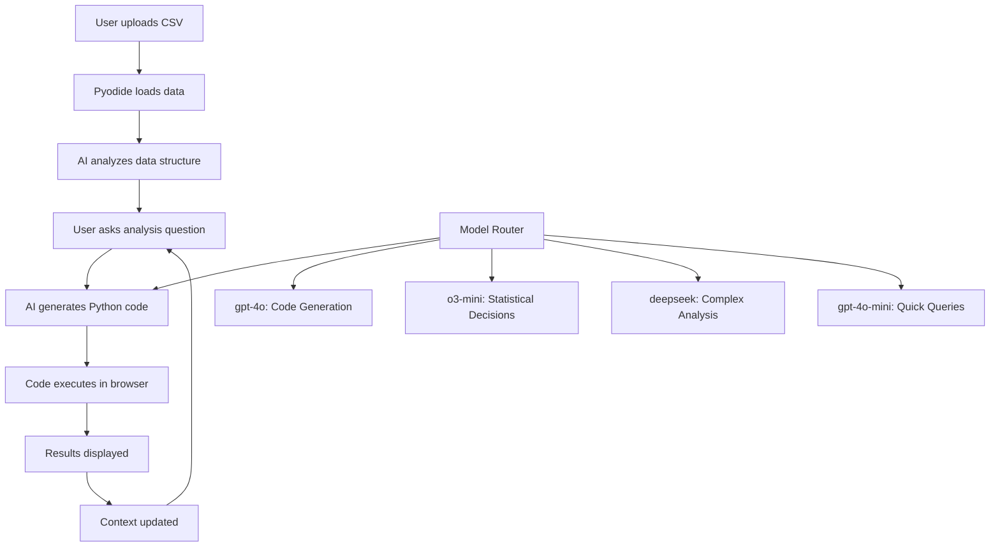

# Python Analysis Implementation Plan

## 1. Objective
Build a **Python Analysis** feature that allows users to upload CSV files and perform interactive data analysis using Python code generated by AI agents. This combines the flexibility of Julius.ai-style analysis with survey research domain expertise.

## 2. Key Concepts

| Term | Description |
|------|-------------|
| **Python Runtime** | Browser-based Python execution using Pyodide (WebAssembly) |
| **AI Agent** | LLM that generates Python code based on natural language queries |
| **Analysis Context** | Current state including dataset, previous analyses, and findings |
| **Code Execution Chain** | Series of Python operations building on each other |
| **Interactive Notebook** | Jupyter-like experience in the browser |

## 3. Architecture Overview



## 4. Technical Stack

### 4.1 Browser Python Runtime
- **Pyodide v0.26.1** - Full Python with scientific packages
- **Pre-loaded packages**: pandas, numpy, matplotlib, scipy, statsmodels
- **WebWorker execution** - Non-blocking UI during computation
- **Memory management** - Handle large datasets efficiently

### 4.2 AI Agent System
- **Model Router** - Different models for different tasks:
  - `gpt-4o`: Primary code generation and insights
  - `o3-mini`: Statistical analysis decisions  
  - `deepseek`: Complex data transformations
  - `gpt-4o-mini`: Quick queries and validation
- **Context Management** - Maintain analysis history and data understanding
- **Error Handling** - Fix code issues and suggest alternatives

### 4.3 Frontend Architecture
```
Page Layout (following LAYOUT_PATTERN.md)
├── Header with SidebarTrigger
├── File Upload Panel
├── Data Preview Section
├── Chat Interface (reuse existing components)
├── Code Execution Area
├── Results Display (tables, charts, text)
├── Analysis History Sidebar
└── Export/Share Options
```

## 5. Implementation Phases

### Phase 1: Basic Infrastructure (Day 1-2) ✅ COMPLETED
**Goal**: Get Pyodide running with basic code execution

**Tasks**:
1. ✅ Create test page at `src/app/(secure)/python-analysis/page.tsx`
2. ✅ Follow `LAYOUT_PATTERN.md` structure exactly
3. ✅ Integrate Pyodide CDN and basic Python execution
4. ✅ File upload → CSV loading into pandas DataFrame
5. ✅ Simple code execution with output capture
6. ✅ Basic error handling and display
7. ✅ Add navigation menu integration

**Success Criteria**: ✅ ALL COMPLETED
- ✅ User can upload CSV file
- ✅ File loads into Pyodide pandas
- ✅ Simple Python code executes and shows results
- ✅ Layout matches existing cohort-chat style

**Components Created**:
- ✅ `usePyodide.tsx` - Browser Python runtime
- ✅ `useAnalysisContext.tsx` - State management
- ✅ `FileUpload.tsx` - CSV upload with validation
- ✅ `DataPreview.tsx` - Dataset overview
- ✅ `CodeEditor.tsx` - Python code editor
- ✅ `ResultsPanel.tsx` - Execution results
- ✅ `AnalysisChat.tsx` - AI placeholder

### Phase 2: AI Integration (Day 3-4) ✅ COMPLETED
**Goal**: Connect AI agents for code generation

**Tasks**:
1. ✅ Create `/api/python-analysis/generate-code` endpoint
2. ✅ Implement model routing system (gpt-4o, o3-mini, deepseek, gpt-4o-mini)
3. ✅ Build context management (data schema + analysis history)
4. ✅ Create specialized prompts for survey analysis domain expertise
5. ✅ Handle code execution errors gracefully
6. ✅ Streaming code generation and execution (`/api/python-analysis/generate-code-stream`)
7. ✅ Enhanced AnalysisChat component with AI integration
8. ✅ Visual indicators for AI-generated code
9. ✅ Follow-up suggestions and model information display

**Success Criteria**: ✅ ALL COMPLETED
- ✅ User asks natural language question
- ✅ AI generates appropriate Python code based on analysis type
- ✅ Code displays with explanation and model information
- ✅ Generated code can be executed directly
- ✅ Error handling works with user feedback
- ✅ Follow-up suggestions provided automatically

**AI Features Implemented**:
- ✅ **Smart Model Routing**: Automatically selects best model for analysis type
  - gpt-4o-mini: Quick queries, small datasets
  - o3-mini: Statistical analysis and reasoning
  - deepseek-coder: Complex data transformations
  - gpt-4o: Default code generation
- ✅ **Survey Research Expertise**: Domain-specific prompts and analysis patterns
- ✅ **Context Awareness**: Uses dataset schema and previous analysis
- ✅ **Streaming Generation**: Real-time code generation display
- ✅ **Interactive Follow-ups**: AI suggests next analysis steps

### Phase 3: Advanced Analysis Features (Day 5-6)
**Goal**: Survey-specific intelligence and advanced capabilities

**Tasks**:
1. Survey methodology awareness (sample sizes, significance testing)
2. Automatic demographic analysis suggestions
3. Statistical visualization generation
4. Cohort filtering integration
5. Analysis chaining and context building
6. Export capabilities (code, results, reports)

**Success Criteria**:
- AI understands survey data patterns
- Generates appropriate statistical tests
- Creates meaningful visualizations
- Maintains analysis context across queries

### Phase 4: Polish & Integration (Day 7)
**Goal**: Production-ready feature

**Tasks**:
1. Performance optimization (large datasets)
2. Security review (code sandboxing)
3. Integration with existing cohort system
4. User experience improvements
5. Documentation and testing

## 6. API Design

### 6.1 Code Generation Endpoint
`POST /api/python-analysis/generate-code`

**Request**:
```json
{
  "query": "Show me the correlation between age and income",
  "dataSchema": {
    "columns": ["age", "income", "education"],
    "types": {"age": "int", "income": "float", "education": "string"},
    "sampleData": [...]
  },
  "analysisHistory": [
    {"code": "df.describe()", "output": "...", "timestamp": "..."}
  ],
  "analysisType": "statistical|exploratory|visualization",
  "model": "gpt-4o"
}
```

**Response**:
```json
{
  "code": "# Analyze correlation between age and income\nimport matplotlib.pyplot as plt\n...",
  "explanation": "This code calculates the correlation coefficient and creates a scatter plot...",
  "suggestedFollowups": [
    "Break down by education level",
    "Test for statistical significance"
  ]
}
```

### 6.2 Model Routing Logic
```javascript
function selectModel(analysisType, complexity, dataSize) {
  if (analysisType === 'quick-query' || dataSize < 1000) return 'gpt-4o-mini';
  if (analysisType === 'statistical-test') return 'o3-mini';
  if (analysisType === 'complex-transformation') return 'deepseek';
  return 'gpt-4o'; // default for code generation
}
```

## 7. Survey Research Intelligence

### 7.1 Domain-Specific Prompts
- **Survey Methodology**: Understanding of response rates, sampling, weighting
- **Statistical Significance**: Automatic testing for meaningful differences
- **Demographic Analysis**: Standard breakdowns by age, gender, income, etc.
- **Question Types**: Likert scales, multiple choice, open-ended analysis
- **Bias Detection**: Awareness of common survey biases and limitations

### 7.2 Pre-built Analysis Templates
- Cross-tabulation analysis
- Demographic segmentation
- Trend analysis over time
- Response pattern analysis
- Statistical significance testing
- Correlation and regression analysis

## 8. Security & Performance

### 8.1 Security Measures
- **Sandboxed Execution**: Pyodide runs in isolated environment
- **Code Review**: AI-generated code validation before execution
- **File Restrictions**: Only CSV/Excel uploads allowed
- **Memory Limits**: Prevent browser crashes from large operations
- **No External Access**: Python code cannot access external URLs

### 8.2 Performance Optimization
- **WebWorker Usage**: Non-blocking execution
- **Chunked Processing**: Handle large datasets in pieces
- **Caching**: Cache analysis results and data summaries
- **Progressive Loading**: Show results as they're generated
- **Memory Management**: Clean up unused DataFrames

## 9. User Experience Design

### 9.1 Workflow
1. **Data Upload**: Drag & drop CSV with instant preview
2. **Auto-Analysis**: AI suggests initial exploration based on data
3. **Interactive Chat**: Natural language queries generate code
4. **Live Execution**: Code runs automatically with streaming results
5. **Result Exploration**: Click on results to dive deeper
6. **Export Options**: Download code, data, or full analysis report

### 9.2 Visual Design
- **Code Editor**: Syntax-highlighted Python code display
- **Results Panel**: Tables, charts, and text outputs
- **History Sidebar**: Previous analyses with click-to-rerun
- **Progress Indicators**: Show execution status and timing
- **Error Messages**: Helpful debugging information

## 10. Integration Points

### 10.1 Existing System Leverage
- **Layout Pattern**: Follow `LAYOUT_PATTERN.md` exactly
- **Chat Components**: Reuse existing chat UI and streaming
- **Model Selection**: Use current model preference system
- **Authentication**: Standard user session handling
- **Database**: Optional saving of analysis sessions

### 10.2 Future Enhancements
- **Cohort Integration**: Load survey data directly from database
- **Digital Twin Analysis**: Analyze respondent personas
- **Prediction Markets**: Statistical modeling for betting insights
- **Report Generation**: Auto-create analysis reports
- **Collaboration**: Share analyses between users

## 11. Success Metrics

### 11.1 Technical Metrics
- **Load Time**: Pyodide initialization < 5 seconds
- **Execution Speed**: Simple analyses < 2 seconds
- **Memory Usage**: Handle datasets up to 50MB
- **Error Rate**: < 5% code generation failures

### 11.2 User Experience Metrics
- **Task Completion**: Users can complete basic analysis end-to-end
- **Code Quality**: Generated code is readable and efficient
- **Analysis Accuracy**: Results match expected statistical outcomes
- **User Satisfaction**: Positive feedback on flexibility vs. guided queries

## 12. File Structure

```
src/app/(secure)/python-analysis/
├── page.tsx                 # Main analysis page
├── components/
│   ├── FileUpload.tsx       # CSV upload component
│   ├── DataPreview.tsx      # Data table preview
│   ├── CodeEditor.tsx       # Python code display
│   ├── ResultsPanel.tsx     # Output display
│   ├── AnalysisChat.tsx     # Chat interface
│   └── HistorySidebar.tsx   # Analysis history
├── hooks/
│   ├── usePyodide.tsx       # Pyodide integration
│   ├── useCodeExecution.tsx # Code running logic
│   └── useAnalysisContext.tsx # State management
└── utils/
    ├── pyodideSetup.ts      # Pyodide initialization
    ├── codeGeneration.ts    # AI code generation
    └── dataProcessing.ts    # CSV parsing and validation

src/app/api/python-analysis/
├── generate-code/route.ts   # Code generation endpoint
├── execute/route.ts         # Optional server execution
└── save-session/route.ts    # Save analysis session
```

## 13. Development Timeline

| Day | Focus | Deliverables |
|-----|-------|-------------|
| 1 | Pyodide Setup | Basic page, file upload, Python execution |
| 2 | UI Components | Data preview, results display, error handling |
| 3 | AI Integration | Code generation API, model routing |
| 4 | Context Management | Analysis history, data schema awareness |
| 5 | Survey Intelligence | Domain-specific prompts and templates |
| 6 | Advanced Features | Visualizations, statistical tests, export |
| 7 | Polish & Testing | Performance, security, user experience |

## 14. Phase 2.5: Conversational Interface Redesign ✅ COMPLETED

**Goal**: Transform UI to match Julius.ai conversational flow

**Major Changes**:
- ✅ **Conversational Layout**: Redesigned to match cohort-chat with persistent chat at bottom
- ✅ **Step-by-Step Analysis**: AI shows thinking process in conversation format
- ✅ **Message Types**: Different styling for user queries, AI responses, code, results, errors
- ✅ **Julius.ai-like Flow**: 
  1. User asks question → "🤔 Analyzing your request..."
  2. AI generates code → Shows code with syntax highlighting
  3. Code executes → "⚡ Executing code..."
  4. Results display → Shows output with execution time
  5. Follow-up suggestions → "✨ What's next?"

**Components Created**:
- ✅ `ConversationView.tsx` - Chat-like message display with syntax highlighting
- ✅ `ChatInput.tsx` - Persistent input at bottom of screen
- ✅ Enhanced message system with avatars, timestamps, metadata

**User Experience**:
- ✅ **Natural Conversation**: Ask questions in plain English
- ✅ **Transparent Process**: See exactly what the AI is doing at each step
- ✅ **Interactive Flow**: Continuous conversation with context awareness
- ✅ **Visual Feedback**: Clear distinction between code, results, and explanations

## 15. Next Steps

1. **Phase 3**: Advanced visualization and statistical analysis templates
2. **Performance Optimization**: Large dataset handling and streaming improvements
3. **User Testing**: Get feedback on the conversational interface
4. **Integration**: Connect with existing cohort filtering system
5. **Export Features**: Save analysis sessions and generate reports

---

*This implementation now provides a Julius.ai-like conversational experience with deep survey research domain expertise, creating a more intuitive and powerful analysis tool.* 