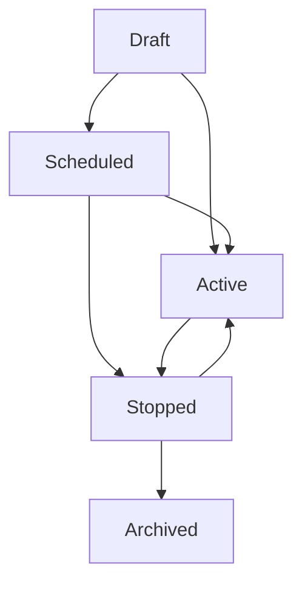

# Survey Campaign Management System

## Overview

The Survey Campaign Management System provides comprehensive lifecycle management for surveys, separating visibility controls from campaign status management. This allows for more granular control over when and how surveys are available to participants.

## Status Model

### Survey Status Values

1. **`draft`** - Survey is being created/edited
   - Not visible to participants
   - Can be edited freely
   - Can transition to: `scheduled`, `active`

2. **`scheduled`** - Campaign is scheduled to start in the future
   - Not yet accepting responses
   - Automatically becomes `active` when `campaign_start_at` is reached
   - Can transition to: `active`, `draft`, `stopped`

3. **`active`** - Campaign is currently running
   - Accepting responses
   - Visible to participants (if `is_public` is true)
   - Can transition to: `stopped`

4. **`stopped`** - Campaign has ended
   - No longer accepting responses
   - Shows completion page to visitors
   - Can transition to: `active` (restart)

5. **`archived`** - Survey is archived (future enhancement)
   - Completely hidden from all interfaces
   - Read-only access for historical purposes

### Visibility Control

- **`is_public`** (boolean) - Controls shareability
  - `true`: Anyone with the link can participate
  - `false`: Restricted access (future: invitation-only)

## Database Schema

### New Columns Added

```sql
-- Campaign timing
campaign_start_at TIMESTAMP NULL     -- When campaign starts accepting responses
campaign_end_at TIMESTAMP NULL       -- When campaign stops accepting responses

-- Manual stop tracking
stopped_at TIMESTAMP NULL            -- When campaign was manually stopped
stopped_by INT NULL                  -- User ID who stopped the campaign
stop_reason TEXT NULL                -- Reason for stopping
```

### Indexes for Performance

```sql
CREATE INDEX idx_surveys_status_public ON surveys (status, is_public);
CREATE INDEX idx_surveys_campaign_dates ON surveys (campaign_start_at, campaign_end_at);
```

## API Endpoints

### Campaign Management API

#### POST `/api/surveys/[id]/campaign`

Manage survey campaign status.

**Request Body:**
```json
{
  "action": "start|stop|schedule",
  "reason": "Optional stop reason",
  "campaignStartAt": "2024-02-01T10:00:00Z",
  "campaignEndAt": "2024-02-15T23:59:59Z"
}
```

**Actions:**
- `start`: Immediately activate campaign
- `stop`: Stop active campaign with optional reason
- `schedule`: Set future start/end times

#### GET `/api/surveys/[id]/campaign`

Get campaign status and details.

**Response:**
```json
{
  "status": true,
  "campaign": {
    "id": 123,
    "title": "Survey Title",
    "status": "active",
    "is_public": true,
    "campaign_start_at": "2024-02-01T10:00:00Z",
    "campaign_end_at": "2024-02-15T23:59:59Z",
    "response_count": 45,
    "can_start": false,
    "can_stop": true,
    "can_schedule": false
  }
}
```

### Public Survey Status API

#### GET `/api/public/surveys/[slug]/status`

Get survey status for stopped survey handling.

## User Interface Components

### CampaignStatusCard

React component for managing campaign status with:
- Visual status indicators
- Response count and timing information
- Action buttons (Start, Stop, Schedule)
- Error handling and loading states

**Usage:**
```tsx
<CampaignStatusCard 
  campaign={campaignData}
  onStatusChange={handleStatusChange}
/>
```

### Survey Completed Page

Special page shown when users visit stopped surveys:
- **Route:** `/survey/[slug]/completed`
- Shows completion message with participant count
- Lists other active surveys for continued participation
- Encourages user signup for survey testing program

## Automated Campaign Management

### Integrated Campaign Management

**Existing Cron System Enhanced**

The campaign management has been integrated into your existing cron system:

- **Script:** `scripts/close-expired-surveys.js` (existing)
- **API:** `/api/surveys/cron/close-expired` (enhanced)

Now automatically handles:
1. **Legacy System**: Closes surveys past their `end_at` date
2. **Campaign Activation**: Scheduled campaigns → Active when `campaign_start_at` reached  
3. **Campaign Expiration**: Active campaigns → Stopped when `campaign_end_at` reached

**Usage:**
```bash
# Run manually (same as before)
node scripts/close-expired-surveys.js

# Your existing cron job continues to work unchanged
# Recommended frequency: every 5-15 minutes
```

### SurveyRepo Methods

New repository methods for campaign management:

```typescript
// Start a campaign
await SurveyRepo.startCampaign(surveyId, userId)

// Stop a campaign
await SurveyRepo.stopCampaign(surveyId, userId, reason)

// Schedule a campaign
await SurveyRepo.scheduleCampaign(surveyId, userId, startAt, endAt)

// Get campaign status
await SurveyRepo.getCampaignStatus(surveyId, userId)

// Automated management
await SurveyRepo.autoActivateScheduled()
await SurveyRepo.autoStopExpired()
```

## Email System Integration

### Enhanced Survey Completion Emails

Survey completion emails now include:
- Rich HTML design with gradients
- List of 4-5 available active surveys
- Direct links to participate in other surveys
- Digital twin information and tips
- Responsive design for all devices

**Email Types:**
- **New User**: Purple gradient design
- **Returning User**: Green gradient design

### Email Survey Filtering

Updated to include surveys with status `published` OR `active`:

```typescript
const surveys = await db.execute(`
  SELECT * FROM surveys 
  WHERE (status = 'published' OR status = 'active') 
  AND is_public = 1 
  ORDER BY created_at DESC 
  LIMIT 5
`);
```

## Survey Flow Updates

### Stopped Survey Handling

When users visit a stopped survey:
1. Survey page checks status on load
2. Redirects to `/survey/[slug]/completed` if stopped
3. Completed page shows thank you message
4. Lists alternative active surveys
5. Encourages continued participation

### Status Transitions



## Migration Applied

**File:** `migrations/20250131_update_survey_status_model.sql`

1. Updated existing 'published' surveys to 'active'
2. Added new campaign management columns
3. Created performance indexes
4. Set default values for existing data

## Benefits

### For Survey Creators
- **Precise Control**: Schedule campaigns for optimal timing
- **Professional Management**: Stop campaigns with documented reasons
- **Performance Insights**: Track campaign lifecycle metrics
- **Automated Operations**: Set-and-forget scheduling

### For Participants
- **Clear Communication**: Know when surveys are active vs completed
- **Continued Engagement**: Discover other active surveys
- **Better Experience**: No confusion about survey availability

### For System
- **Scalability**: Automated campaign management
- **Data Integrity**: Proper status tracking
- **Performance**: Optimized queries with indexes
- **Maintainability**: Clean separation of concerns

## Future Enhancements

1. **Advanced Scheduling**
   - Recurring campaigns
   - Time zone support
   - Quota-based stopping

2. **Access Control**
   - Invitation-only surveys
   - User group restrictions
   - Permission-based access

3. **Analytics Integration**
   - Campaign performance metrics
   - Response rate tracking
   - Conversion funnel analysis

4. **Notification System**
   - Campaign start/stop notifications
   - Automated participant communications
   - Admin alerts for campaign events

## Monitoring & Maintenance

### Key Metrics to Track
- Campaign activation success rate
- Average campaign duration
- Response rates by campaign status
- System performance impact

### Regular Tasks
- Monitor scheduler script execution
- Review campaign completion reasons
- Analyze participant flow patterns
- Update email templates based on engagement

### Troubleshooting
- Check scheduler script logs for automation issues
- Verify database indexes for performance
- Monitor API response times for campaign operations
- Review email delivery rates and engagement 